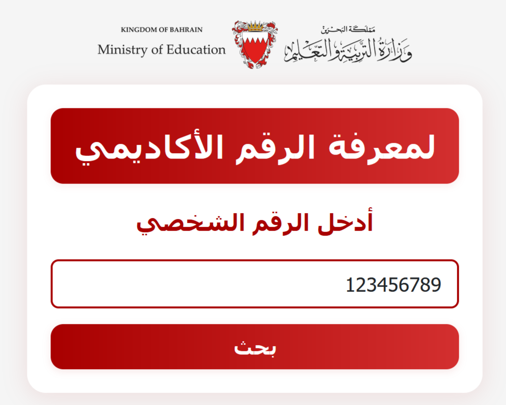
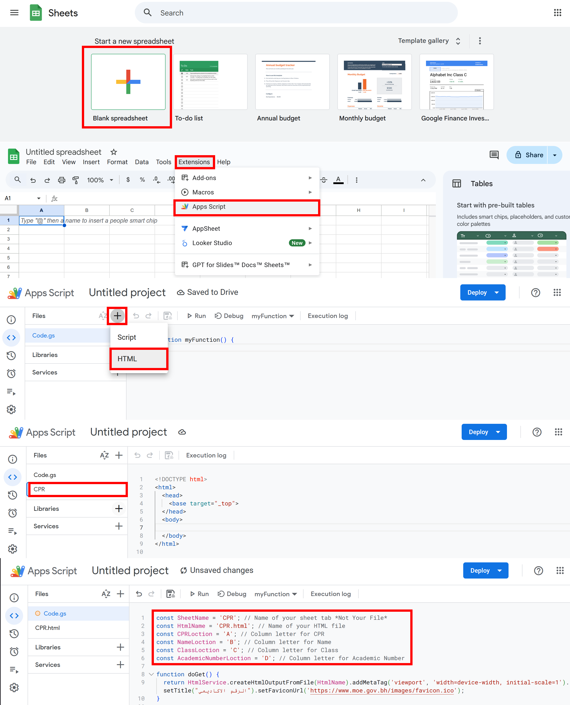
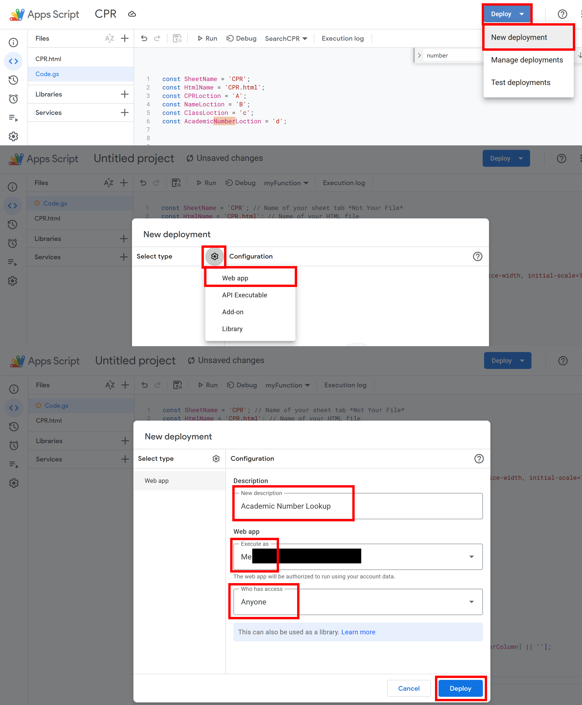

# Academic Number Lookup



This project allows users to enter their CPR and retrieve their academic number, name, and class from a Google Sheet using a web interface.

---

## Features
- Search by CPR (personal number)
- Instant results in a modal dialog
- Responsive, mobile-friendly design
- Easy to customize for your own sheet structure

## How to Use
- Open the web app link.
- Enter your CPR (personal number) and click "بحث" (Search).
- If found, your name, class, and academic number will appear in a modal.

---

## Setup Instructions

### 1. Prepare Your Google Sheet
1. Create a new [Google Sheet.](https://docs.google.com/spreadsheets/)
2. Name your sheet tab (default: `CPR`).
3. Add columns for CPR, Name, Class, and Academic Number.
> You can change the column letters and sheet name later in the script.

### 2. Add the Script and HTML
1. Open the Google Sheet.
2. Go to **Extensions > Apps Script**.
3. Replace the default `Code.gs` with the provided `Code.gs` file.
4. Add a new HTML file named `CPR.html` and paste the provided HTML code.

### 3. Configure the Script
At the top of `Code.gs`, you can change these values to match your sheet:

```js
const SheetName = 'CPR'; // Name of your sheet tab *Not Your File*
const HtmlName = 'CPR.html'; // Name of your HTML file
const CPRLoction = 'A'; // Column letter for CPR
const NameLoction = 'B'; // Column letter for Name
const ClassLoction = 'C'; // Column letter for Class
const AcademicNumberLoction = 'D'; // Column letter for Academic Number
```
- Change the values as needed to match your sheet structure.
- Column letters are case-insensitive.



### 4. Deploy as a Web App
1. In the Apps Script editor, click **Deploy > New deployment**.
2. Click **Select type > Web app**.
3. Enter a description.
4. Set **Execute as** to: `Me`
5. Set **Who has access** to: `Anyone`
6. Click **Deploy** and authorize the script.
7. Copy the web app URL and share it with users.



---

## Troubleshooting
- If you see "لم يتم العثور على صفحة البيانات" (Sheet not found), check the `SheetName` value.
- If you see "لا توجد بيانات في الصفحة" (No data), make sure your sheet has data.
- Make sure the column letters match your sheet structure.

---
